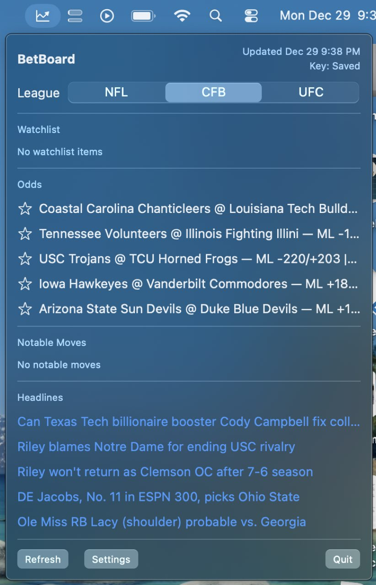
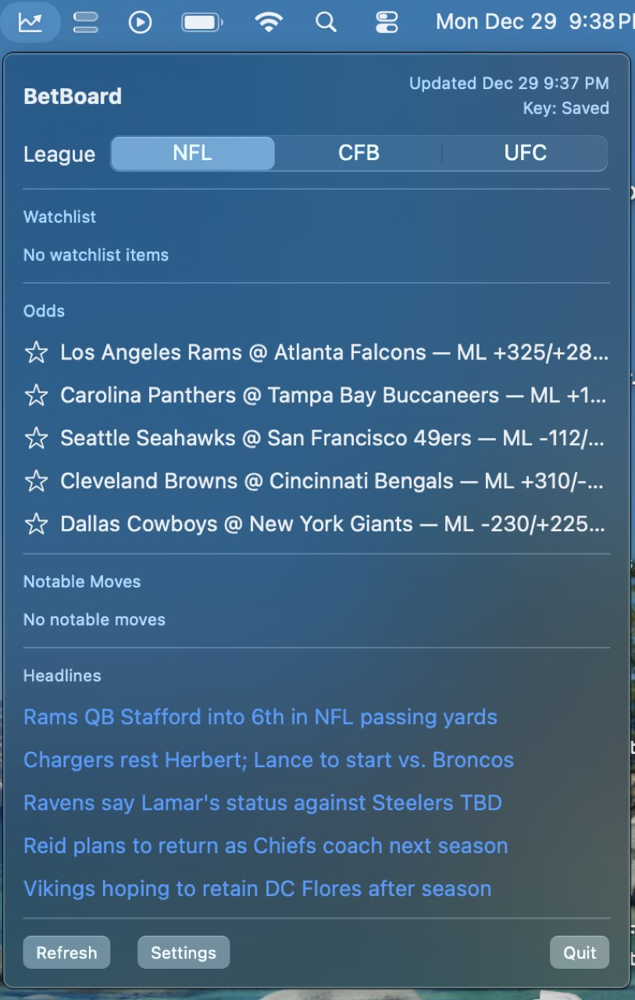

# BetBoard

Sports odds + news terminal MVP. This is a non-touting awareness tool that surfaces market odds, movement, and headlines.

## Screenshots




## Quick start

```bash
python -m venv .venv
source .venv/bin/activate
pip install -e .
```

Set an API key:

```bash
export ODDS_API_KEY="your_key"
```

Run:

```bash
betboard run
```

## macOS menu bar app

The macOS app fetches data directly from The Odds API and ESPN RSS.

Run locally:

```bash
cd macos/BetBoardBar
swift run
```

Build a .app bundle:

```bash
cd macos/BetBoardBar
./scripts/package_app.sh
```

Install a release build:

1) Download the latest `BetBoard-<version>.zip` from GitHub Releases.
2) Unzip and drag `BetBoard.app` into `/Applications`.
3) If macOS blocks the app, run:

```bash
xattr -dr com.apple.quarantine /Applications/BetBoard.app
```

## Config
Copy the sample config to `~/.betboard/config.toml` and edit as needed.

```bash
mkdir -p ~/.betboard
cp config.sample.toml ~/.betboard/config.toml
```
